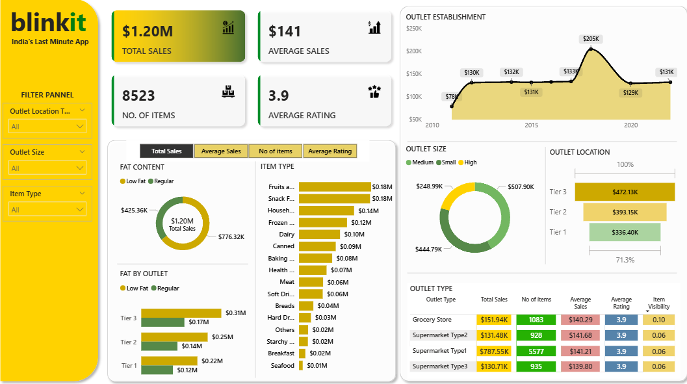

# 🛒 Blinkit Sales & Customer Insights Dashboard – Power BI Project

This Power BI dashboard presents an end-to-end analysis of Blinkit's sales performance, outlet operations, and product dynamics. It leverages KPIs and visual insights to uncover patterns in customer behavior, outlet type performance, fat content impact, and more.

 

---

## 📌 Business Requirement

**Objective:**  
To conduct a comprehensive analysis of Blinkit’s operations by examining key business metrics such as total sales, item count, customer ratings, and outlet efficiency—ultimately identifying opportunities for optimization and growth.

---

## 🧠 Steps Followed in the Project

1. **Requirement Gathering:** Defined mock business requirements (as would be given by a client).
2. **Data Walkthrough:** Analyzed data fields, formats, and relationships.
3. **Data Connection:** Imported data from Excel.
4. **Data Cleaning & Transformation:** Used Power Query for handling nulls, fixing formats, and preparing data.
5. **Data Modeling:** Established relationships across multiple tables.
6. **Data Processing:** Created new calculated columns and cleaned categories.
7. **DAX Measures:** Built custom KPIs like total sales, average revenue, average rating, and item counts.
8. **Layout Design:** Customized the canvas layout for better UX beyond Power BI's default sizing.
9. **Visualizations:** Created charts, slicers, and matrices according to the business use case.
10. **Insight Generation:** Summarized business takeaways based on trends and visual patterns.

---

## 📊 Key Metrics & Visuals

| Visual / KPI                         | Description                                                                 |
|-------------------------------------|-----------------------------------------------------------------------------|
| **Total Sales**                     | $1.20M in total revenue across all item types                               |
| **Average Sale Value**              | $141 average sale per transaction                                           |
| **Number of Items Sold**            | 8,523 items                                                                 |
| **Average Rating**                  | 3.9 average rating from customers                                           |
| **Sales by Fat Content**            | Donut chart showing revenue split between regular and low-fat products      |
| **Sales by Item Type**             | Horizontal bar chart showing top-performing product categories              |
| **Fat Content by Outlet Type**      | Stacked column comparing fat content impact by outlet tier                  |
| **Sales by Outlet Establishment Year** | Line chart showing outlet performance over time                           |
| **Sales by Outlet Size**            | Donut chart analyzing sales from small, medium, and high outlets            |
| **Sales by Outlet Location**        | Horizontal bar chart showing geographical sales distribution                |
| **All KPIs by Outlet Type**         | Matrix card showing sales, rating, and item visibility by outlet type       |

---

## 📈 Sample Insights

- **Tier 3 outlets** contributed the most to total sales, followed by Tier 2.
- **Regular fat content** products led in total sales vs. low-fat items.
- **Supermarket Type1** outlets are top performers in total revenue.
- **Snack foods and fruits** were among the highest revenue-generating items.
- **Medium-sized outlets** accounted for the largest sales segment.
- **Outlet establishment years post-2015** saw noticeable growth.

---

## ⚙️ Tools & Techniques Used

- **Power BI Desktop**
- **DAX (Data Analysis Expressions)**
- **Power Query (ETL)**
- **Custom Dashboard Layout**
- **Interactive Slicers & Filters**
- **Multi-chart Visual Design**

---

## 📝 Notes

- This project uses anonymized/mock data for educational and demonstration purposes.
- No real or proprietary Blinkit data has been used.

---
